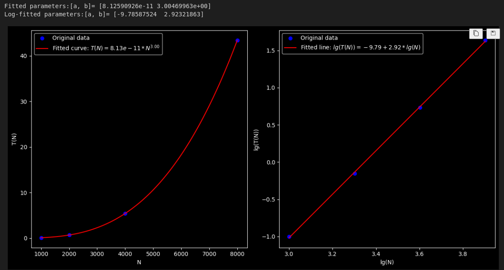
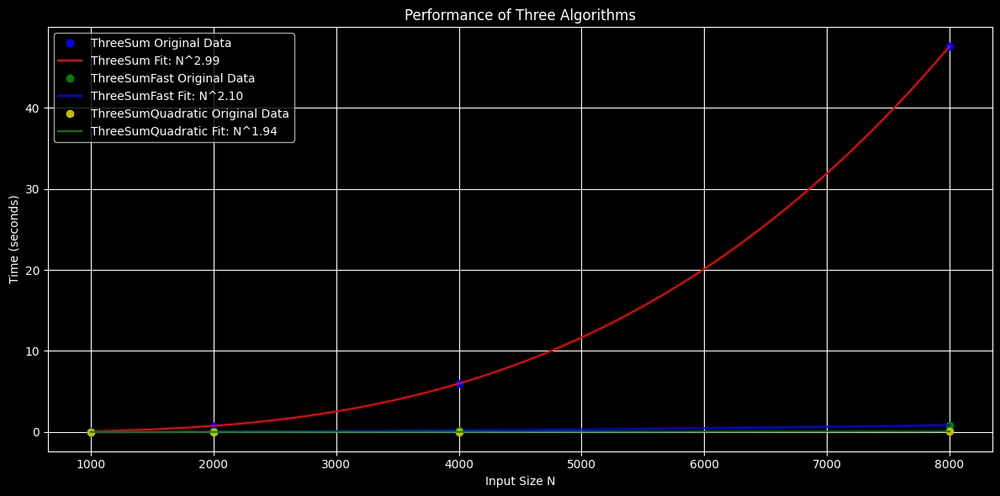

#### 1. 通过绘制时间开销图来确定算法复杂度；观察->获取数学模型

- [时间测试.ipynb](algs4/algs4_java/algs4-master-RQTN/algs4-master/src/analysis_of_algs/时间测试.ipynb) ThreeSum.java是一个$O(N^3)$的问题

```bash
java-algs4 DoublingTest

sh TestTwoSum.sh
#!/bin/bash
java-algs4 TwoSum input/1Kints.txt 0 > output/TestTwoSum_res.txt &&
java-algs4 TwoSum input/2Kints.txt 0 >> output/TestTwoSum_res.txt &&
java-algs4 TwoSum input/4Kints.txt 0 >> output/TestTwoSum_res.txt &&
java-algs4 TwoSum input/8Kints.txt 0 >> output/TestTwoSum_res.txt &&
java-algs4 TwoSum input/16Kints.txt 0 >> output/TestTwoSum_res.txt &&
java-algs4 TwoSum input/32Kints.txt 0 >> output/TestTwoSum_res.txt

```



- TwoSum.java是一个$1/2O(N^2)$ ，所以倍增后都x2了；
- TwoSumFast.java, $O(NlgN)$
- ThreeSum $O(N^3) O(N^2logN)$

  ```bash
  java-algs4 ThreeSumCompare input/1Kints.txt input/2Kints.txt input/4Kints.txt input/8Kints.txt > output/ThreeSumCompare.txt
      					ThreeSum	     ThreeSumFast	ThreeSumQuadratic
      /1Kint	           0.1020	           0.0130	           0.0020
      /2Kint	           0.7520	           0.0430	           0.0040
      /4Kint	           5.9730	           0.1960	           0.0170
      /8Kint	          47.5710	           0.8350	           0.0650
  ```

