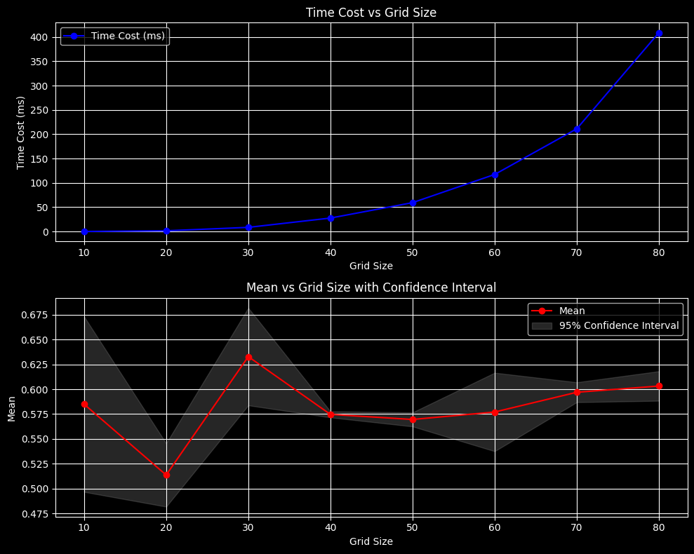
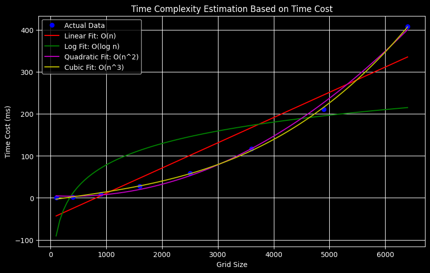
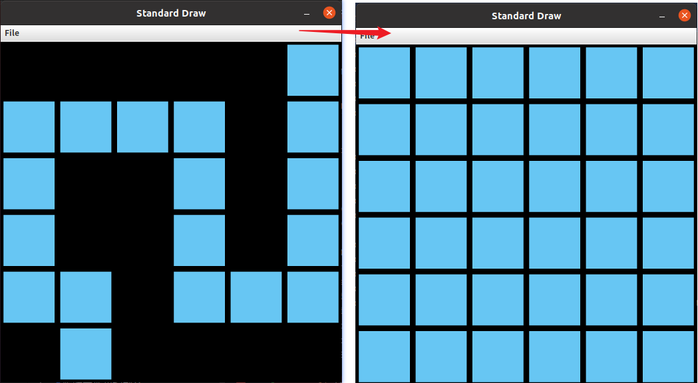
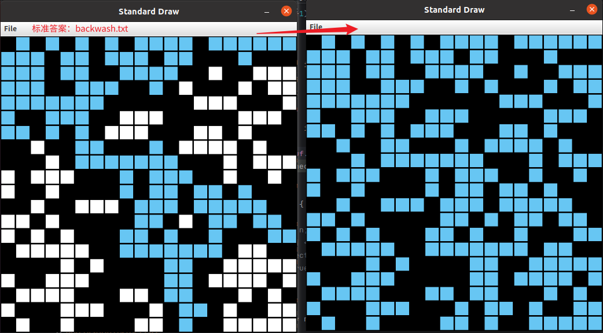

[toc]

# week1 Percolation

- 作业参考：[Algorithms, Princeton, Coursera课程整理与回顾_普林斯顿算法课-CSDN博客](https://blog.csdn.net/YunHsiao/article/details/50405328)
  - 他的百度云网盘里面含有所有详细的资料；代码；测试用例；思考；等；资料在百度网盘：[百度网盘-算法4-课后作业资料](https://pan.baidu.com/s/1hrnFvMk?_at_=1757832373276) 和前面的课程这里和回顾一起看，收益更好；
- 学习笔记类参考：[whitejava2的普林斯顿公开课算法 每个视频的笔记摘要](http://blog.csdn.net/caipeichao2/article/details/28448947)，是每个视频的中文笔记精炼，在学习时参考很大，节约时间。
- 我将用C++语言再写一遍，复现一下java的部分，争取齐全。
  - java部分对比 correctness通过是第一步，正确性；下面需要比较内存和时间开销，来考察算法的复杂度和时间性能；

|  index  |        data structure        | percolates method | time cost  | test inputs | Memory | timing |
| :------: | :------------------: | :---------------: | ---------- | :---------: | ------ | ------ |
|  zhr_v0  |      quick-uion（影响不大）      |       2-for       | $O(N^2)$ |    pass    |        |        |
|    v1    | weighted-quick-uinon |       2-for       |            |            |        |        |
|    v2    | weighted-quick-uinon | virtual-top & bottom但倒灌 | 常数时间！ |            |        |        |
|          |                      |                  |            |            |        |        |
| 标准答案 |  PercolationAnswer  | weighted-quick-uinon * 2 | 常数时间&不倒灌 |            |        |        |

```java
// 关键接口的梳理
public class Percolation {
   public Percolation(int N)               // create N-by-N grid, with all sites blocked
   public void open(int i, int j)          // open site (row i, column j) if it is not open already
   public boolean isOpen(int i, int j)     // is site (row i, column j) open?
   public boolean isFull(int i, int j)     // is site (row i, column j) full?
   public boolean percolates()             // does the system percolate?

   public static void main(String[] args)   // test client (optional)
}
// 调用上面的接口 percolates()?---no--->open(i,j) 
open()
	|-> union(p, left, right, top, bottom) // 把当前节点同上下左右四领域的一起连同
percolates()
    |-> 每次open一个点后，都去检查一下是否percolates
    |-> 检查头和尾部，有没有链接
  
public static void main(String[] args){
     Percolation    pl = new Percolation_zhr_v1(N);
    do {
        row     = StdRandom.uniform(1, N+1);
        column  = StdRandom.uniform(1, N+1);
        if (pl.isOpen(row, column))
            continue;
        pl.open(row, column);
        openCount++;
    } while (!pl.percolates());
}
```

#### v1-quick-Union & 2-for~$O(N^2)$

##### 1.1 流程打通

1. C++里面记录每个site的状态，open/close是用二维数组，还是用 `vector<vector<int>>`呢？ 二维vector是如何存储的？如何使用的？底层是怎么的？

```bash
1. (i,j)为[0，N-1]，N*N；暂时不做虚拟节点；判断是否percolates时先做循环；先做基础工作，正确性，再考虑优化；
2. stat数组的表示形式？bool数组？还是vector形式？
3. open、close的状态要如何利用起来？
```

- C++版本/percolates_2层for循环遍历 `./Percolation < ../input/10_1.txt` C++可执行文件；

```bash
(base) dl@dl:~/zhr/code/algs4/algs_hw_cplusplus/percolation/build$ ./Percolation < ../input/10_1.txt 
grid:10,20次    cost=0.1078ms           mean = 0.515     stddev = 0.120208       95% confidence interval = [0.3484, 0.6816]
grid:20,20次    cost=1.50575ms          mean = 0.615     stddev = 0.0106066      95% confidence interval = [0.6003, 0.6297]
grid:30,20次    cost=7.8093ms           mean = 0.588333  stddev = 0.101352       95% confidence interval = [0.447867, 0.7288]
grid:40,20次    cost=24.8084ms          mean = 0.603125  stddev = 0.0521491      95% confidence interval = [0.53085, 0.6754]
grid:50,20次    cost=54.6999ms          mean = 0.5942    stddev = 0.0115965      95% confidence interval = [0.578128, 0.610272]
grid:60,20次    cost=119.849ms          mean = 0.577083  stddev = 0.00923168     95% confidence interval = [0.564289, 0.589878]
grid:70,20次    cost=215.894ms          mean = 0.59949   stddev = 0.0197701      95% confidence interval = [0.57209, 0.62689]
grid:80,20次    cost=375.698ms          mean = 0.591484  stddev = 0.00806543     95% confidence interval = [0.580306, 0.602663]
```

把时间开销在python中绘制为图，脚本为：[algs_hw_cplusplus/percolation/result.ipynb](algs_hw_cplusplus/percolation/result.ipynb)

- 时间复杂度拟合如下所示：由于grid-size实际为$N^2$，所以时间开销更接近于$O(N^3)$



)

> - 由于C++没有algs4合适的绘制图；一时半会无法复制；所以将C++转为java，然后再去测试；这就设计到标准答案Percolation.java和我自己的对比；那么如何实现，old和new的兼容呢；以及后续优化；
> - 除了在代码里面改多个类；那么chatgpt提供了工厂模式来实例化正确的类；

##### 工程模式实例化Percolation算法

```java
// PercolationFactory.java
public class PercolationFactory {
    public static Percolation getPercolation(String type) {
        if ("new".equals(type)) {
            return new PercolationNew();
        } else {
            return new PercolationOld();
        }
    }
}
```

```java
public class Main {
    public static void main(String[] args) {
        String algoType = args.length > 0 ? args[0] : "old"; // 默认使用"old"
        Percolation percolation = PercolationFactory.getPercolation(algoType);

        percolation.open(0, 0);
        System.out.println("Percolates: " + percolation.percolates());
    }
}

```

##### 1.2 algs4课程上的测试用例测试

- correctness

```bash
Test1: Open predetermined list of sites using file inputs 使用预定义的文件输入的sites
	java-algs4 PercolationVisualizer  input/input6.txt 0
    java-algs4 PercolationVisualizer  input/input8.txt 0
    java-algs4 PercolationVisualizer  input/input8-no.txt 0
    java-algs4 PercolationVisualizer  input/input10-no.txt 0
    java-algs4 PercolationVisualizer  input/greeting57.txt 0 # 新年快乐
    java-algs4 PercolationVisualizer  input/heart25.txt 0
===> passed # 这是正确性通过了
Test 2: ===> passed 
Test 3: N=1 and N=2(corner case test)
	java-algs4 PercolationVisualizer inpu1.txt 1 
	java-algs4 PercolationVisualizer input1-no.txt 1 # failed
	java-algs4 PercolationVisualizer input2.txt 1 
	java-algs4 PercolationVisualizer input2-no.txt 1

```

- 测试正确答案的程序：
- 测试我的答案的程序：

##### bug修复记录:

- corner case failed

```bash
(base) dl@dl:~/zhr/code/algs4/algs_hw_java/algs-percolation$ java-algs4 PercolationTester input/input1-no.txt 0
Using PercolationAnswer
does not percolate
(base) dl@dl:~/zhr/code/algs4/algs_hw_java/algs-percolation$ java-algs4 PercolationTester input/input1-no.txt 1
Using Percolation_zhr_v1
percolates
```

##### 1.3 内存开销&时间开销测试

- Timing 1a-1e

```bash
(base) dl@dl:~/zhr/code/algs4/algs_hw_java/algs-percolation$ java-algs4 PercolationStats 8 1
class PercolationAnswer
class WeightedQuickUnionUF
class WeightedQuickUnionUF
union() = 96     find() = 314   
N=8 T=1  time = 0.014 seconds   mean = 0.59375  stddev = NaN    95%% confidence Interval  = [NaN,NaN]
```

- 作业官网的参考

```bash
(base) dl@dl:~/zhr/code/algs4/algs_hw_java/algs-percolation$ java-algs4 PercolationStats 8 1
class Percolation_zhr_v1
class QuickUnionUF
union() = 26     find() = 4320  
N=8 T=1  time = 0.014 seconds   mean = 0.421875 stddev = NaN    95%% confidence Interval  = [NaN,NaN]
```

|              index              |        method        |             percolates method             | time | union() | find() | N | ratio       |
| :-----------------------------: | :-------------------: | :---------------------------------------: | ---- | ------- | :----: | - | ----------- |
|             zhr_v1             |      quick-uion      |              2-for$O(N^2)$              |      | 26      |  4320  | 8 | 4320/26=180 |
|               v2               | weighted-quick-uinon |                   2-for                   |      |         |        |   |             |
|               v3               |                      |                                          |      |         |        |   |             |
|                                |                      |                                          |      |         |        |   |             |
| 标准答案<br />PercolationAnswer | 2 weighted-quick-uion | virtual-head<br />virtual-end $O(logN)$ |      | 96      |  314  | 8 | 3           |

- 下面是PercolationAnswer的时间开销Test结果：

```bash
Test 1a-1e: Create an N-by-N percolation system; open sites at random until
            the system percolates. Count calls to connected(), union() and
            find() in WeightedQuickUnionUF.
                                                 2 * connected()
                 N   seconds       union()              + find()        constructor
---------------------------------------------------------------------------------------------
=> passed        8     0.00           58                   254                   1   
=> passed       32     0.00          741                  2774                   1   
=> passed      128     0.01        11221                 42034                   1   
=> passed      512     0.09       185037                691396                   1   
=> passed     1024     0.23       728324               2709416                   1   
==> 5/5 tests passed
```

```bash
union() = 59     find() = 186   raio=3.152542372881356 N=8 T=1  	time = 0.016 seconds   mean = 0.4375   stddev = NaN    95%% confidence Interval  = [NaN,NaN]
union() = 1767   find() = 5728  raio=3.241652518392756 N=32 T=1         time = 0.018 seconds   mean = 0.658203125      stddev = NaN    95%% confidence Interval  = [NaN,NaN]
union() = 23843  find() = 77576 raio=3.253617413916034 N=128 T=1        time = 0.022 seconds   mean = 0.60296630859375 stddev = NaN    95%% confidence Interval  = [NaN,NaN]
union() = 373271 find() = 1222880 raio=3.2761184233438976 N=512 T=1        time = 0.175 seconds   mean = 0.5965080261230469       stddev = NaN    95%% confidence Interval  = [NaN,NaN]
union() = 1473098 find() = 4830080 raio=3.2788585688121223 N=1024 T=1       time = 1.498 seconds   mean = 0.5925168991088867       stddev = NaN    95%% confidence Interval  = [NaN,NaN]
//==================================================QuicUnionUF
class Percolation_zhr_v1
class QuickUnionUF
union() = 28	 find() = 5820	raio=207.85714285714286 N=8 T=1	 time = 0.018 seconds	mean = 0.484375	stddev = NaN	95%% confidence Interval  = [NaN,NaN]
union() = 836	 find() = 2248552	raio=2689.6555023923447 N=32 T=1	 time = 0.028 seconds	mean = 0.6494140625	stddev = NaN	95%% confidence Interval  = [NaN,NaN]
union() = 11922	 find() = 500431718	raio=41975.48381144103 N=128 T=1	 time = 0.639 seconds	mean = 0.60565185546875	stddev = NaN	95%% confidence Interval  = [NaN,NaN]
//==================================================WeightedQuickUnionUF
class Percolation_zhr_v1
class WeightedQuickUnionUF
open() = 48 site()/percolates() union() = 63	 find() = 12722	raio=201. N=8 T=1	 time = 0.017 seconds	mean = 0.75	stddev = NaN	95%% confidence Interval  = [NaN,NaN]
open() = 598 site()/percolates() union() = 659	 find() = 1779326	raio=2700.4 N=32 T=1	 time = 0.026 seconds	mean = 0.583984375	stddev = NaN	95%% confidence Interval  = [NaN,NaN]
open() = 9442 site()/percolates() union() = 10769	 find() = 461968598	raio=42898. N=128 T=1	 time = 0.295 seconds	mean = 0.5762939453125	stddev = NaN	95%% confidence Interval  = [NaN,NaN]
//==================================================WeightedQuickUnionUF +  top + bottom 两个虚拟节点，就将时间开销大幅度缩减
//======但是会带来倒灌问题！
class Percolation_zhr_v2
class WeightedQuickUnionUF
open() = 42 site()/percolates() union() = 64	 find() = 250	raio=3.90625 N=8 T=1	 time = 0.016 seconds	mean = 0.65625	stddev = NaN	95%% confidence Interval  = [NaN,NaN]
open() = 629 site()/percolates() union() = 819	 find() = 3618	raio=4.4 N=32 T=1	 time = 0.018 seconds	mean = 0.6142578125	stddev = NaN	95%% confidence Interval  = [NaN,NaN]
open() = 9578 site()/percolates() union() = 11367	 find() = 51482	raio=4.5 N=128 T=1	 time = 0.019 seconds	mean = 0.5845947265625	stddev = NaN	95%% confidence Interval  = [NaN,NaN]
open() = 157202 site()/percolates() union() = 188930	 find() = 857428	raio=4.5 N=512 T=1	 time = 0.159 seconds	mean = 0.5996780395507812	stddev = NaN	95%% confidence Interval  = [NaN,NaN]
open() = 615613 site()/percolates() union() = 724412	 find() = 3301046	raio=4.5 N=1024 T=1	 time = 1.005 seconds	mean = 0.5870943069458008	stddev = NaN	95%% confidence Interval  = [NaN,NaN]

```

##### backwash问题现象

- 可以看到随着open的调用次数，增加，find()/union() 比例在提高；这里面，是percolates()这个函数的效率太低了；需要优化；
  - 惊不惊喜，意不意外，倒灌了；第一个input6.txt就...了；啊啊啊；
  - **虚拟头节点和第一排全部贯通了，这是个问题；虚拟节点是单向的，不能双向**
  - 得让第一排都连着virtual-top，但是呢相互之间不互通，得是单向的连接，这怎么弄呢？



- solution：在初始化那里进行了第一行和top的union，太早了；应该是open的site才进行连接，试一下
  - （1）是要判断stat[p]=open才和虚拟节点连接
  - （2）isfull是判断当前节点是否和top节点连接，我之前写错了；isFull()只在PercolationVisualize.java中调用，不影响正确性的判断；影响可视化效果；
  - backwash.txt 影响结果的判断；所以有时候要注意；percolates了但是路径不对，这个也要影响的；

```java
public void open(int i, int j) {
	...
    if(i == 1){
        puf.union(p, n*n); // connect to virtual top
    }
    if(i == n){
        puf.union(p, n*n+1); // connect to virtual bottom
    }
    ...
}  
```

- backwash.txt现象：第一行和最后一行全贯穿了；



#### v2
